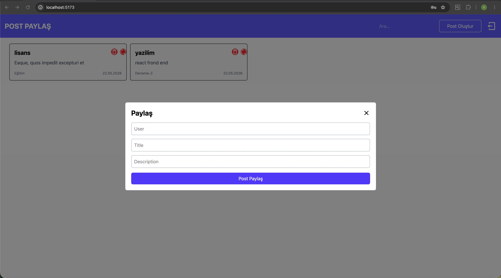
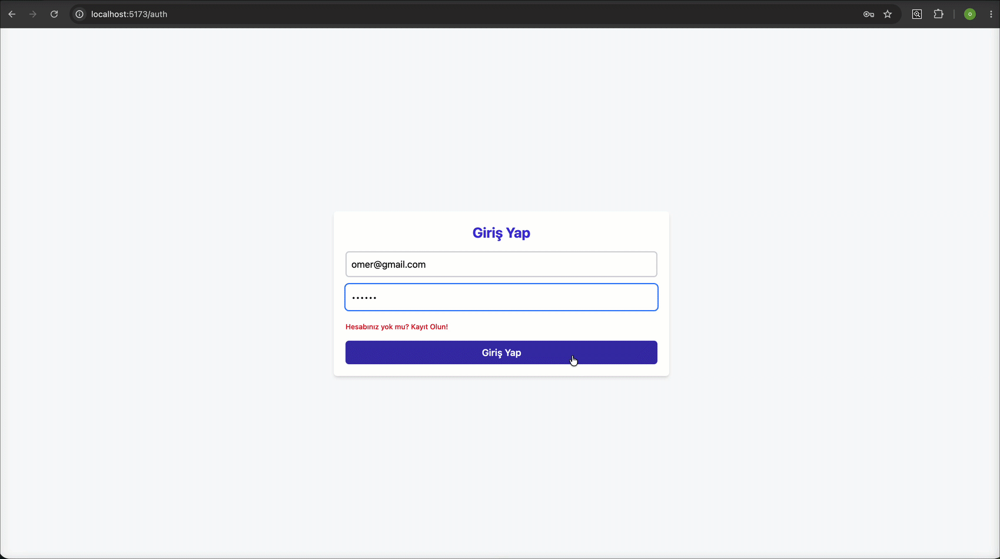

# 🚀 Full-Stack Post Sharing App (MERN)

Bu proje, kullanıcıların kimlik doğrulama işlemlerini tamamlayarak anlık gönderiler (post) paylaşabildiği, modern web standartlarına uygun olarak geliştirilmiş **Full-Stack (MERN)** bir web uygulamasıdır.

---

## 🎯 Projenin Amacı

Projenin temel amacı; güvenli, hızlı ve kullanıcı dostu bir gönderi paylaşım platformu sunmaktır. Kullanıcılar sistemde hesap oluşturabilir, giriş yapabilir ve kart tasarımlı gönderileri dinamik olarak listeleyebilir, oluşturabilir ve yönetebilirler.

---

## 🛠️ Kullanılan Teknolojiler

Uygulama, modern ve yüksek performanslı araçlar kullanılarak iki ana katmanda inşa edilmiştir:

### 💻 Frontend (İstemci)

- **React 19 & Vite:** Hızlı ve modern kullanıcı arayüzü bileşenleri.
- **Redux Toolkit & React-Redux:** Global ve tutarlı durum (state) yönetimi.
- **Tailwind CSS v4:** Modern, esnek ve hızlı arayüz tasarımı.
- **React Router DOM v7:** Hızlı ve sayfa yenilemesiz rota yönetimi.
- **Axios:** Sunucu ile asenkron API iletişimi.
- **React Toastify:** Dinamik kullanıcı bilgilendirme bildirimleri.

### ⚙️ Backend (Sunucu)

- **Node.js & Express.js:** Performanslı ve genişletilebilir RESTful API sunucusu.
- **MongoDB & Mongoose:** Esnek doküman tabanlı veri tabanı ve veri modelleme.
- **JSON Web Tokens (JWT):** Güvenli ve durumsuz (stateless) oturum kontrolü.
- **BcryptJS:** Şifrelerin veri tabanında güvenli bir şekilde hash'lenerek saklanması.
- **Cors & Body-Parser:** İsteklerin güvenle çözümlenmesi ve kaynak paylaşım ayarları.

---

## 📐 Yöntemler ve Mimari Yaklaşımlar

1.  **İstemci-Sunucu Ayrımı (Decoupled Architecture):** Frontend ve Backend bağımsız projeler halinde geliştirilmiştir. İletişim tamamen JSON formatındaki RESTful isteklerle sağlanır.
2.  **Güvenli Kimlik Doğrulama:** Oturum yönetimi için JWT kullanılmış, şifreler BcryptJS algoritması ile geri döndürülemez şekilde hash'lenmiştir. Rotalar middleware yapılarıyla korunmaktadır.
3.  **Global Eyalet Yönetimi (Global State):** Gönderilerin ve kullanıcı oturum verilerinin takibi, bileşenler arası veri karmaşasını önlemek adına Redux Toolkit ile tek bir merkezden yönetilmektedir.
4.  **Temiz Kod Yapısı:** Sunucuda Controller, Router, Model ve Middleware katmanları tamamen ayrılarak modülerlik ve sürdürülebilirlik en üst seviyede tutulmuştur.

---

## 🚀 Hızlı Başlangıç

### 1. Depoyu Klonlayın

```bash
git clone <repository-url>
cd mern
```

### 2. Backend Kurulumu

`server` klasörünün içinde `.env` dosyasını oluşturun ve değişkenleri tanımlayın:

```env
PORT=5001
MONGO_URI=your_mongodb_connection_string
JWT_SECRET=your_jwt_secret_key
```

Ardından bağımlılıkları yükleyip sunucuyu başlatın:

```bash
cd server
npm install
npm start
```

### 3. Frontend Kurulumu

İstemci bağımlılıklarını yükleyin ve geliştirici sunucusunu başlatın:

```bash
cd client
npm install
npm run dev
```

## Ekran Görüntüsü



## Gif


